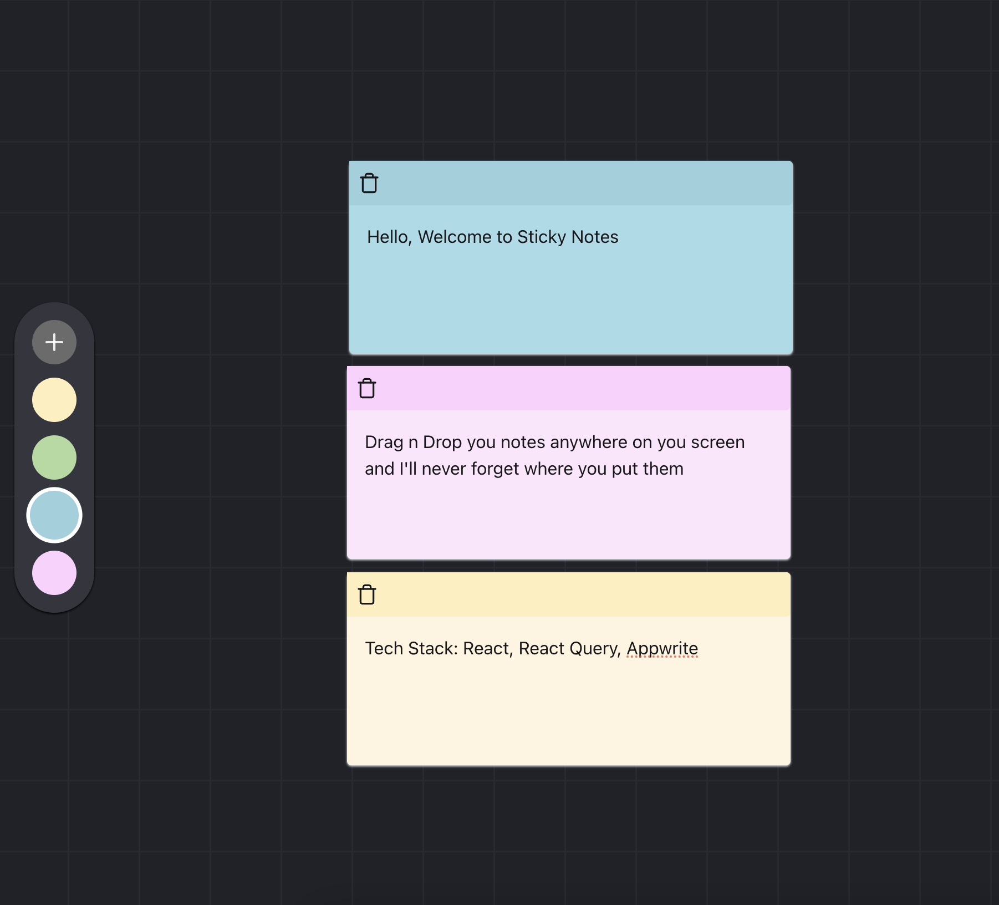

# Sticky Notes App

This is a simple sticky notes application built with React, TypeScript, Vite, and a variety of other technologies. The app allows users to create, edit, delete, and drag around sticky notes. It also supports color customization for each note.

## Techstack

- React
- Typescript
- @tanstack/react-query
- appwrite

## Features

- Create, edit, delete, and drag around sticky notes.
- Color customization for each note.
- Real-time data updates using React Query.
- Responsive design using Tailwind CSS.

## Getting Started

To get started with this project, follow these steps:

1. Clone the repository.
2. Install dependencies by running npm install.
3. Start the development server by running npm run dev.
4. Open your web browser and navigate to http://localhost:5173.

## Contributing

Contributions are welcome. If you find any issues or have suggestions for improvements, please open an issue or submit a pull request.

## License

This project is licensed under the MIT License. See the LICENSE file for details.
